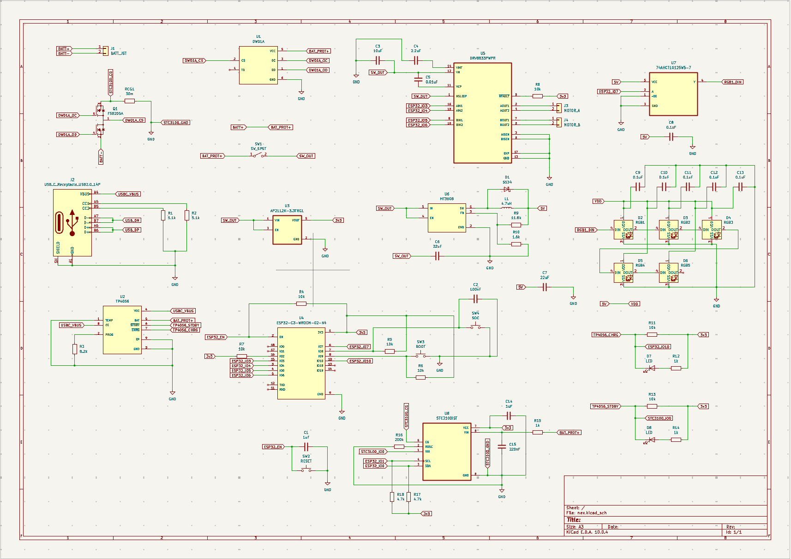
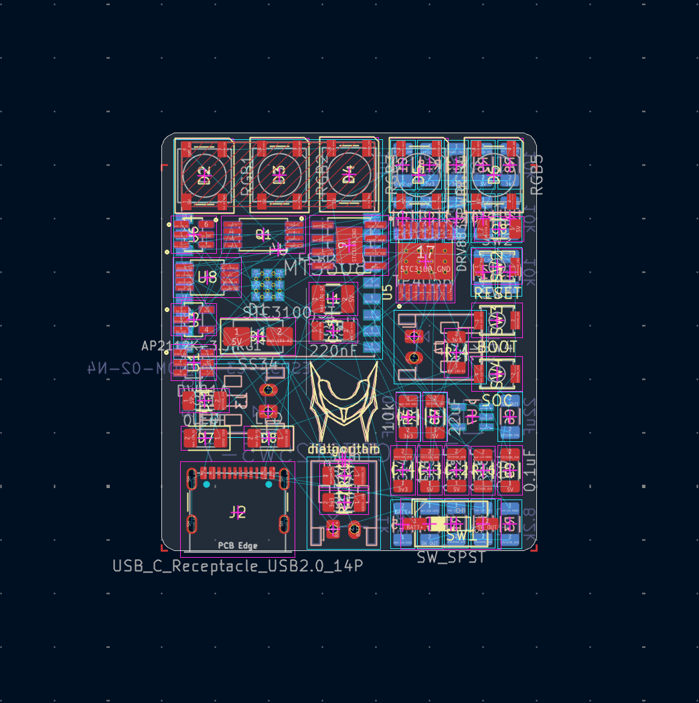
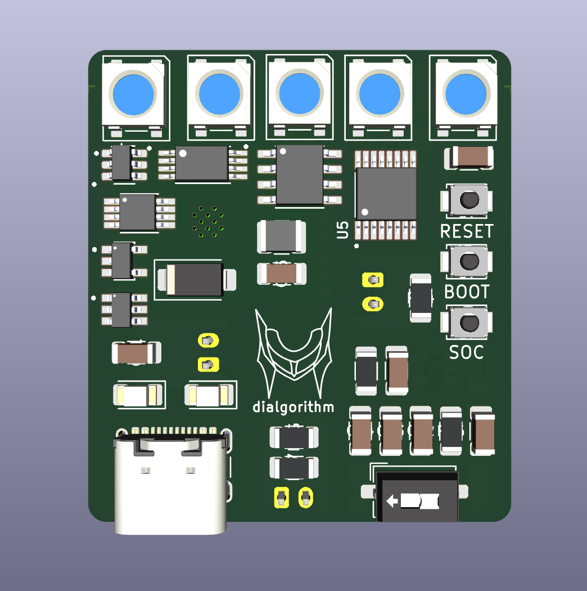
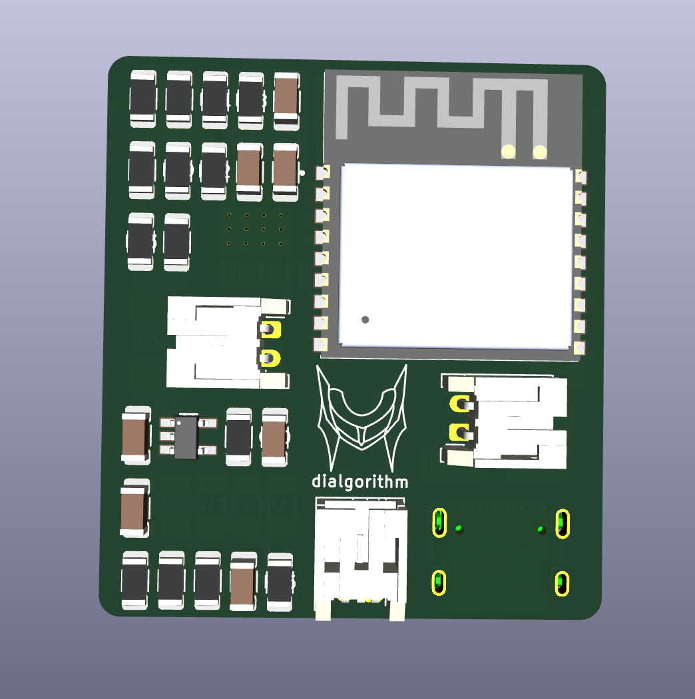
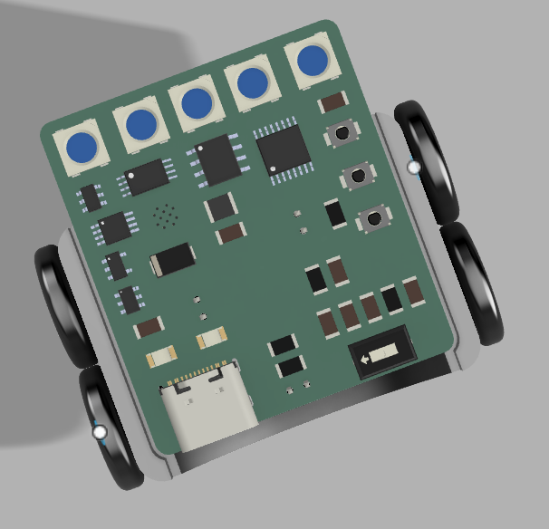
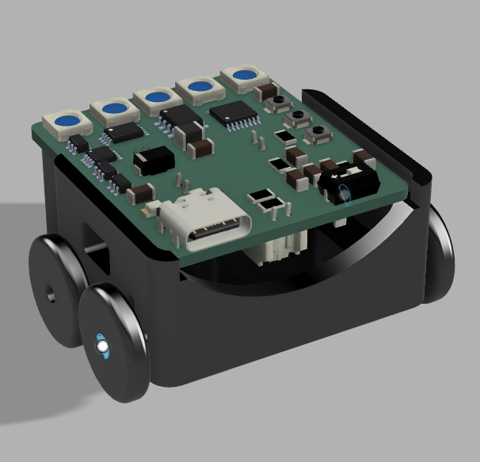
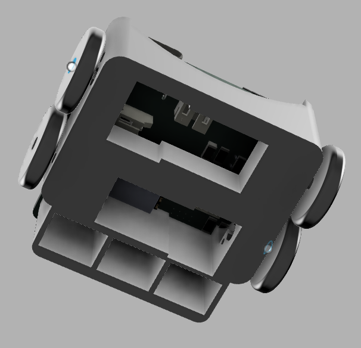

# nex

esp32 based swarm bots based on cv and apriltags.

## design

### kicad

|              schematic              |           pcb           |
| :---------------------------------: | :---------------------: |
|  |  |

|        pcb mockup top         |          pcb mockup bottom          |
| :---------------------------: | :---------------------------------: |
|  |  |

### fusion

|             top             |             side              |              bottom               |
| :-------------------------: | :---------------------------: | :-------------------------------: |
|  |  |  |

## bom

click [here](bom.csv) for the bom.
